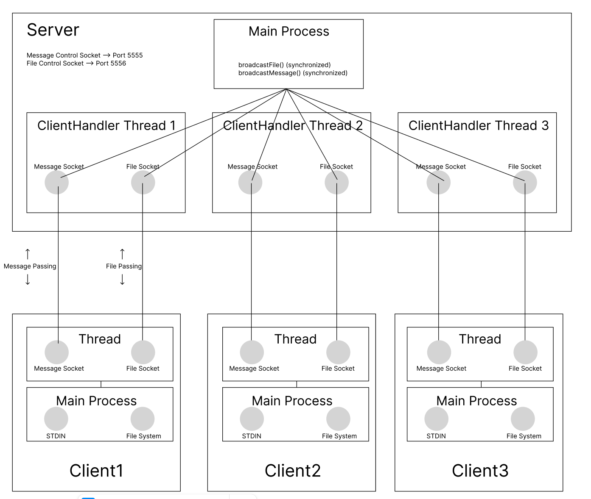

# sofe4790u-assignment1

## Introduction

This is my submission for Distributed Systems Assignment 1 (SOFE 4790U). My project is a chat room hosted on a server and clients can connect to it and send messages to each other. I also implemented a feature for sending files to the other clients. This application is written in Java and utilizes sockets for message passing between the client and the server. Multiple clients can join and connect to the server, where messages that are sent from a client are broadcasted to all other clients, simulating a chat room; files are also supported in this application. This report outlines how to run it, how it works, and the source code of the project itself.

| Novel Features | Applications for the Client To Use  |
|----------------|------------------------------------------------------|
| File broadcasting |  Clients can send files to other clients connected to the server |
| Message Broadcasting | Clients can send messages to other clients connected to the server |

## How To Run It

### Linux/MacOS Scripts

I wrote some scripts to make it easier to compile and run the server and client.

Instructions:

1. Open 4 terminals (1 for the server and 3 for the clients)

1. On the first terminal, run the server by running `tools/build_and_run_server.sh`

1. On the other 3 terminals, run the clients by running `tools/build_and_run_client1.sh`, `tools/build_and_run_client2.sh`, and `tools/build_and_run_client3.sh`

### Manual Compilation

If you want to compile and run the server and clients manually, you can follow these steps:

1. Compile and run server

```bash
cd server
javac -d out ../sofe4790u/a1/server/Server.java
jar cfe server.jar sofe4790u.a1.server.Server -C out sofe4790u
java -jar server.jar 5555 5556
```

2. Compile and run client1

```bash
cd client1
javac -d out ../sofe4790u/a1/client/Client.java
jar cfe client.jar sofe4790u.a1.client.Client -C out sofe4790u
java -jar client.jar localhost 5555 5556 client1
```

3. Compile and run client2

```bash
cd client2
javac -d out ../sofe4790u/a1/client/Client.java
jar cfe client.jar sofe4790u.a1.client.Client -C out sofe4790u
java -jar client.jar localhost 5555 5556 client2
```

4. Compile and run client3

```bash
cd client3
javac -d out ../sofe4790u/a1/client/Client.java
jar cfe client.jar sofe4790u.a1.client.Client -C out sofe4790u
java -jar client.jar localhost 5555 5556 client3
```

## How It Works

There are four processes in this program: Server, Client1, Client2, and Client3.

The Server, in this scenario of having 3 clients, has 3 threads running to handle each client. The server listens for incoming connections from clients and creates a new thread for each client that connects. You can think of the server as a chat room where clients can connect and send messages to each other. It simply forwards the messages from one client to the other clients.

The Clients connect to the server and send messages to each other. The clients can also send files to each other. The file is read and sent to the server, which then forwards it to the other clients. In the client, there is a thread for sending/receiving messages and sending/receiving files from the two sockets. In the client's main process, we are listening for user input from standard input and then sending it to the server. If the client's message begins with `/upload`, we are expecting a file path to be provided. The file is read and sent to the server, so that the server can broadcast it to all other clients.

There are two sockets between the server and the clients: one for sending messages and one for sending files. The server listens for incoming messages and files from the clients and forwards them to the other clients.

### Diagram


